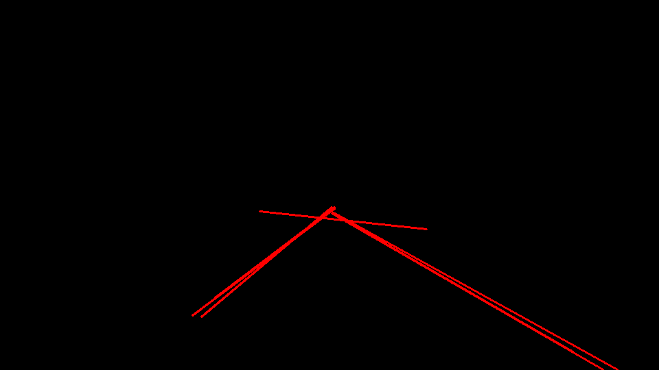

# Project: Finding lane lines on the road

## Table of contents
1. [Overview](#Overview)
2. [Pipeline of the lane detection](#Pipeline-of-the-lane-detection)
3. [Detailed description of the pipeline](#Detailed-description-of-the-pipeline)
4. [Shortcomings of the approach](#Shortcomings-of-the-approach)
5. [Improvements for this pipeline](#Improvements-for-this-pipeline)

Overview 
---
The aim of this project is to find the lane lines on the road for a self driving car.

Pipeline of the lane detection
---
The image processing pipeline to find the lines involves following steps
* Input is an 3-channel color image (an image or a frame of the video). This is our `original image`
* Conversion from `original image` to `grayscale image`
* Blurring the `grayscale image` using _Gaussian Filter_ to obtain `blurred image`
* Applying _Canny edge detection_ for the `blurred image` to obtain the `edge image`
* Selecting suitable region of interest in this `edge image`. Output of this stage is `roi image`
* Use of _hough lines_ algorithm to find lines. Input is `roi image` and output is `line image` and the `line segments`
* With the `line segments` left and right lines are identified and extrapolated them to fill the entire line
* Finally this `extrapolated lines` are superimposed on the `original image` to obtain `final output image`

Detailed description of the pipeline
---

#### Step1: Original Image

#### Step2: Grayscale Image

In this step original image is converted to grayscale image using the helper function.

#### Step3: Blurring

In this step, grayscale image is blurred using gaussian blur helper function. `Kernel size` value is chosen as `7`. In order to obtain the output for challenge.mp4 video, if in the previous frame if the lane is not identified then in the current frame gaussian blur step is skipped.

#### Step4: Edge Detection

In this step, blurred image is passed on to canny edge detector. `Lower threshold` and `Upper threshold` is chosen to be `80` and `240` respectively. In order to obtain the output for challenge.mp4 video, if in the previous frame if the lane is not identified then in the current frame the threshold values are chosen to be `40` and `160`.

#### Step5: ROI Selection

In this step Region of Interest is selected in a trapezoidal form with `vertices`: `(0.4*width, 0.56*height)`, `[0.15*width, height]`, `[0.95*width, height]` and `[0.6*width, 0.56*height]`.

#### Step6: Line Detection

In this step, lines are detected using hough line detection alogorithm. The helper function is modified to return both line segments and the line image. Parameters used for the detection are: `rho = 1`, `theta = pi /180`, `threshold = 10`, `min_line_len = 15` and `max_line_gap = 5`.

#### Step7: Identify left and right lines
In this step left and right lines are identified separately. Lines are identified based on the slope values. Line is identified as right line if the value of the slope lies between `sin(30)` and `sin(60)` and as left line if the value of the slope lies between `cos(120)` and `cos(150)`. The angle values 30, 60, 120 and 150 are selected because the line orientation from the camera view angle will be in this range. This assumes there will not be any horizontal and vertical line markings.

After identifying the left and right line, a new pair of x and y coordinate is found for each line to draw a line segment. To do this `2-point form` of the straight line is used. 
From the hough lines there will be more than one line segment for each left and right lane. So y coordinate value is fixed and x coordinate value is found out for all the lines and the x coordinate value is averaged to get the new x coordinate. This procedure is repeated for other end point and other lane. This will result in 2 points for each line.

#### Step 8: Superimpose the lines on to the original image

From the points obtained in the previous step, 2 lines are drawn using `draw_lines` function. The resulting line image and the original image is fed into `weighted_img` function to obtain the final output image

Shortcomings of the approach
---
* Illumination changes - The parameter values are fine tuned for the images and videos that provided in the test set. It will not work in most cases such as a bright sunny day and the sunlight is directly coming onto the camera, night time where there are street lights and no street lights.
* Different weather conditions such as rainy and snow. In this situation camera cannot see the lane markings, so this pipeline may not work.
* If there is discontinuation in the lane painted on the road, that part of the frames cannot identify the lane markings.
* Horizontal lanes such as STOP line cannot be detected because of the filtering of the lines with the slope values. Currently I have used +- 30 to +- 60 degrees to the horizontal in my code.

Improvements for this pipeline
---
* Adaptive parameter tuning for the Gaussian filter, Canny edge detection and Hough lines based on the illumination changes.
* Prediction of the line segments using the history information when camera cannot find line segments in certain number of frames.